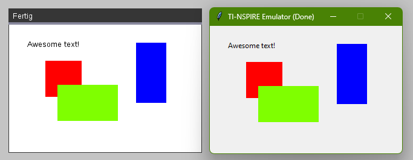

# ti-py4all

Simple emulator to run TI-Nspire python scripts.

> [!WARNING]
> This project is at a very early stage!


Running `test_drawing.py` on the calculator *(left)* and using the simulator *(right)*.

## Usage

Usage should be as similar to using a calculator as possible.

```py
from ti_system import *
from ti_draw import *

set_color(255, 0, 0)
fill_rect(30, 30, 30, 30)
```

For more info see tests.


## Features

Currently implemented modules:

 - ti_system (incomplete)
 - ti_draw (incomplete)